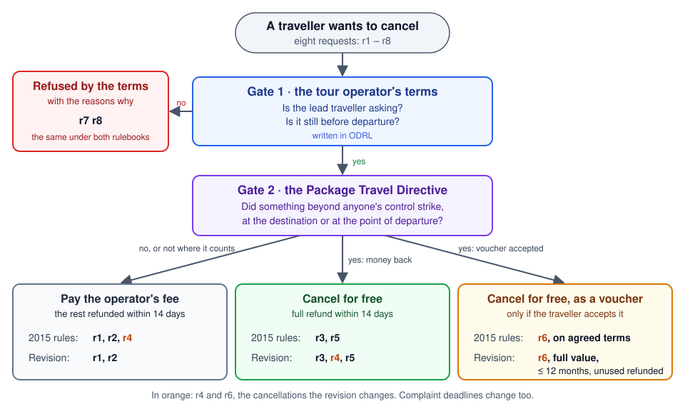

# A package holiday under two rulebooks

*One tour operator, eight cancellations, and EU holiday rules about to change: who pays, who gets their money back, and what would change?*

[package-holiday.py](https://github.com/eyereasoner/peye/blob/main/examples/package-holiday.py) · [output](https://github.com/eyereasoner/peye/blob/main/examples/output/package-holiday.py) · [proof](https://github.com/eyereasoner/peye/blob/main/examples/proof/package-holiday.py) · [check](https://github.com/eyereasoner/peye/blob/main/examples/check/package-holiday.py) · [try it in the playground](https://eyereasoner.github.io/peye/playground/#example=package-holiday)

---

## The situation

A **package holiday** bundles travel and a stay, say a flight and a hotel,
sold together by a tour operator. When a traveller cancels, two things decide
what happens:

1. **The operator's own terms**: who may cancel, and what it costs.
2. **EU law**, the Package Travel Directive, which can override those terms,
   for instance when a hurricane hits the destination.

That law is changing. The 2015 Directive was revised after the pandemic,
when many travellers waited months for refunds or got vouchers they did not
want. Parliament approved the revision on **12 March 2026**, and the Council
then adopted it. So we decide every cancellation twice: under the **2015
rules** and under the **revision**.

---

## The whole decision on one page



Each request passes two gates, in order. A "no" at the first gate ends it.
The picture already shows every result; the rest of this deck explains why.

---

## Gate 1: the operator's terms

The terms are written in **ODRL**, the W3C language for machine-readable
"who may do what" rules. In plain words: the **lead traveller** may cancel,
**before departure**, paying a fee that depends on how soon the trip is:

| Days before departure | Fee |
| --- | --- |
| 60 or more | 25 % of the price |
| 30 to 59 | 50 % |
| 1 to 29 | 100 % |

```python
fact(t('ex:cancellation', 'odrl:constraint', 'ex:conditions'))
fact(t('ex:conditions', 'odrl:and', ['ex:byLeadTraveller', 'ex:beforeDeparture']))
fact(t('ex:beforeDeparture', 'odrl:leftOperand', 'ex:daysBeforeDeparture'))
fact(t('ex:beforeDeparture', 'odrl:operator', 'odrl:gt'))
fact(t('ex:beforeDeparture', 'odrl:rightOperand', 0))
```

The program reads these triples to decide: the policy is data, not a
comment. Delete any one of its 15 triples and the outcome changes;
`peye --unused` checks exactly that.

---

## Gate 2: the Directive, 2015 and revised

| | 2015 rules | Revision |
| --- | --- | --- |
| Cancel for free when something beyond anyone's control strikes… | at the **destination** | at the destination **or the point of departure** |
| Money back | within 14 days | within 14 days |
| Vouchers instead of money | no rules | **optional**: full value, at most **12 months**, unused value refunded |
| Complaints | no EU deadlines | acknowledged within **7 days**, answered within **60** |

"Beyond anyone's control" is the plain-words version of the law's
*unavoidable and extraordinary circumstances*.

---

## The eight cancellations

| Request | What happened | 2015 rules | Revision |
| --- | --- | --- | --- |
| r1 | changed plans, 90 days ahead (€2,400) | fee €600, €1,800 back | the same |
| r2 | changed plans, 20 days ahead (€1,800) | fee €1,800, nothing back | the same |
| r3 | hurricane at the destination (€1,500) | free, €1,500 back | the same |
| r4 | departure airport closed by floods (€2,100) | fee €2,100, nothing back | **free, €2,100 back** |
| r5 | hurricane; refuses the voucher offered (€1,200) | free, €1,200 back | the same |
| r6 | hurricane; accepts the voucher (€1,600) | voucher, on agreed terms | **voucher with guarantees** |
| r7 | asks two days into the trip | refused by the terms | the same |
| r8 | Hugo asks, but Ivy booked the trip | refused by the terms | the same |

Every refund is due within 14 days.

---

## What the revision changes

```python
changed(cancellation('r4'), struct('from', pay_fee(percent(100), fee(2100), refund(0), within_days(14))), to(refund(2100, within_days(14))))
changed(cancellation('r6'), struct('from', voucher(value(1600), terms('as_agreed'))), to(voucher(value(1600), valid_months(12), 'unused_value_refunded')))
```

- **r4**: the floods were at the airport of departure, not at the
  destination. Under the 2015 rules David loses all €2,100; under the
  revision he cancels for free.
- **r6**: Farid's voucher now comes with guarantees: worth the full €1,600,
  valid for at most 12 months, and any unused value is paid back.

Both complaints change as well: from "whatever national law says" to an
acknowledgement within 7 days and a reasoned reply within 60.

---

## Why: the proof in plain words

Take r4 under the revision. The proof records, step by step:

1. The booking is with SunTrips, the offer's assigner, and the request is the
   offer's action, `ex:cancel`. Of its `odrl:and` constraint, both operands
   hold: David is the lead traveller, and 5 days left is more than 0. So the
   terms **permit** the cancellation.
2. The floods struck at the point of departure, which the revision counts:
   the cancellation is **free**.
3. So David gets the full price back, **€2,100 within 14 days**
   (Art. 12(4)).

Under the 2015 rules, step 2 goes the other way: departure does not count,
so the fee band for 1 to 29 days in the duty's fee scale applies, 100 %,
computed as €2,100.

---

## Checked, with nothing taken on trust

A separate checker read all **218 steps**: 185 were matched to a program
line, and 33 comparisons and calculations, such as the fees and refunds,
were redone and agreed. Verdict: **checked**.

Nothing is taken on trust: the policy's `odrl:and` constraint lists its
conditions, and each is decided either way, so no step rests on "there is
nothing else". The proof even passes
`--strict-proof`, which rejects any trusted step.

What the certificate does **not** show: that the law is modelled completely,
or that the operator's fees are reasonable, as the Directive requires. It
shows that the outcomes follow from these rules and these facts.

---

## Try it

```sh
python -m peye examples/package-holiday.py            # the answers
python -m peye --proof examples/package-holiday.py    # answers with their proof
python -m peye --proof examples/package-holiday.py > /tmp/holiday-proof.py
python -m peye --strict-proof --check-proof /tmp/holiday-proof.py examples/package-holiday.py
```

Or open it in the [playground](https://eyereasoner.github.io/peye/playground/#example=package-holiday).
Two experiments, one at each gate:

- let Ivy ask instead of Hugo (`by('hugo')` → `by('ivy')` in r8): the terms
  now permit it, and at 40 days the fee is 50 %, €650 of €1,300;
- move r1's request to 45 days (`days(90)` → `days(45)`): the fee rises
  from 25 % to 50 %, €1,200 of €2,400.

---

## Takeaway

Holiday rules decide real money: here, whether David loses €2,100. When the
rules change, peye shows what changes, for whom and why, and a machine
checks every step, without taking anything on trust.

---

## Sources and assumptions

[Directive (EU) 2015/2302](https://eur-lex.europa.eu/eli/dir/2015/2302/oj/eng) ·
[European Parliament, 12 March 2026](https://www.europarl.europa.eu/news/en/press-room/20260306IPR37536/package-travel-parliament-greenlights-new-rules-to-protect-holidaymakers) ·
[ODRL 2.2](https://www.w3.org/TR/odrl-model/)

The revision applies only after Member States transpose it (28 months) and
start applying it (6 more months); it is modelled as if it applied. Whether
circumstances are unavoidable and extraordinary, and significantly affect the
holiday, is given as input. The fee scale is the operator's; its
reasonableness is not assessed. National rules and the revision's other
changes are outside this model.
