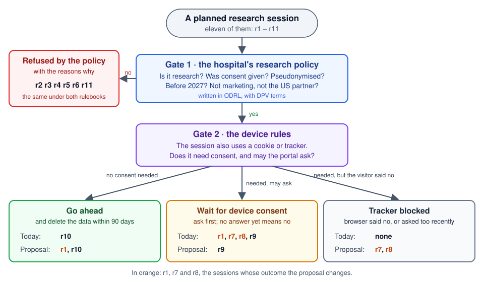

# A research portal under two rulebooks

*One hospital, one research policy, two sets of device rules: which research sessions may go ahead, and what would change?*

[research-portal.py](https://github.com/eyereasoner/peye/blob/main/examples/research-portal.py) · [output](https://github.com/eyereasoner/peye/blob/main/examples/output/research-portal.py) · [proof](https://github.com/eyereasoner/peye/blob/main/examples/proof/research-portal.py) · [check](https://github.com/eyereasoner/peye/blob/main/examples/check/research-portal.py) · [try it in the playground](https://eyereasoner.github.io/peye/playground/#example=research-portal)

---

## The situation

A hospital runs a portal through which partners in a research consortium use
patients' **lab results**: sensitive health data.

Two different questions decide whether a planned session may go ahead:

1. **Does the hospital's research policy allow this use of the data?**
2. **The portal page also places a cookie or tracker on the visitor's device.
   Is that allowed, and does it need the visitor's consent?**

The second question is about to get new rules: the European Commission's
**Digital Omnibus proposal** (19 November 2025) would change them. So we ask
both questions twice: under the rules **today** and under the **proposal**.

---

## The whole decision on one page



Each session passes two gates, in order. A "no" at the first gate ends it,
whatever the device rules say. The picture already shows every result;
the rest of this deck explains why.

---

## Gate 1: the hospital's research policy

The policy is written in **ODRL**, the W3C language for machine-readable
"who may do what with which data" rules, using terms from **DPV**, the Data
Privacy Vocabulary. In plain words, consortium partners may use the lab
results **for research**, only with the patient's **consent**, only
**pseudonymised** (names replaced by codes), and only **before 2027**. Two
things are forbidden outright: passing the data on for **marketing**, and
any use by the **US partner**.

```python
fact(
    process('ex:r1', 'ex:hospital', 'ex:partnerBE', 'dpv:Use', 'ex:labResults', 'dpv:AcademicResearch', 'dpv:Consent', 'dpv:ConsentGiven', 'dpv:Pseudonymisation', 20261115),
)
```

This is session r1: for the hospital, the data controller, the Belgian
partner wants to use the lab results for academic research, on consent,
pseudonymised, on 15 November 2026. DPV knows that academic research *is*
research, so the purpose fits.

The policy is data the program reads, not a comment: it governs r1 because
it is an ODRL agreement assigned by r1's data controller. Delete any one of
its 26 triples and the outcome changes; `peye --unused` checks exactly that.

---

## Gate 2: the device rules, today and proposed

| | Today (ePrivacy Directive) | Proposal (new GDPR Art. 88a–b) |
| --- | --- | --- |
| The portal's own visitor statistics | consent needed | **no consent needed** |
| The visitor's browser says "no tracking" | not binding | **must be respected** |
| The visitor refused earlier | may ask again | **not again within 6 months** |
| Strictly needed to run the requested service | no consent needed | no consent needed |

The device question is separate from the research question. A tracker that
needs no consent does **not** stand in for the patient's consent to research.

---

## The eleven sessions

| Session | What is special about it | Today | Proposal |
| --- | --- | --- | --- |
| r1 | valid research; the portal's own statistics | wait for consent | **go ahead** |
| r2 | personalised advertising, on legitimate interest, not consent | refused | refused |
| r3 | passing the data on for advertising | refused (forbidden) | refused (forbidden) |
| r4 | the patient withdrew consent | refused | refused |
| r5 | encrypted, not pseudonymised; after 2026 | refused | refused |
| r6 | the US partner | refused (forbidden) | refused (forbidden) |
| r7 | valid research; ad tracker; browser says no | wait for consent | **blocked** |
| r8 | valid research; ad tracker; refused 5 months ago | wait for consent | **blocked** |
| r9 | valid research; ad tracker; refused 6 months ago | wait for consent | wait for consent |
| r10 | valid research; only what the service needs | go ahead | go ahead |
| r11 | passing the data to a partner, for research | refused (no permission) | refused (no permission) |

"Wait for consent" means: ask first, and do nothing until the visitor agrees.

---

## What the proposal changes

```python
changed(session('ex:r1'), struct('from', await_device_consent('ex:research')), to(permit('ex:research')))
changed(session('ex:r7'), struct('from', await_device_consent('ex:research')), to(deny_device('refused_by_signal')))
changed(session('ex:r8'), struct('from', await_device_consent('ex:research')), to(deny_device('do_not_ask_again')))
```

(`from` is a reserved word in Python, so the "from" part is written
`struct('from', ...)`.)

- **r1** may now go ahead: the portal's own statistics need no consent.
- **r7** is blocked: the browser's "no" now has to be respected.
- **r8** is blocked: the visitor said no five months ago, too recently to ask.

Just as telling: **r4** uses the same statistics as r1, but stays refused,
because the patient withdrew consent to research. Easier device rules cannot
fix that. And **r11** shows how precise the policy is: the marketing ban does
not catch sharing for research, but nothing permits that sharing either.

---

## Data breaches: a separate duty

The hospital already holds data, so it also plans what to do if that data
leaks. Here too the proposal changes the rules:

| What leaked (assessed risk) | Tell the regulator: today | Tell the regulator: proposal | Tell the patients |
| --- | --- | --- | --- |
| encrypted laptop, key safe (unlikely) | no | no | no |
| researchers' contact addresses (some) | within 72 hours | **no** | no |
| patients' lab records (high) | within 72 hours | **within 96 hours, via one EU entry point** | without undue delay, in both |

Every breach is recorded internally, even when nobody must be told.

---

## Why: the proof in plain words

Take r1 under the proposal. The proof records, step by step:

1. r1's purpose, academic research, falls under research (DPV).
2. Each of the policy's five conditions holds for r1, and no prohibition
   applies, so the policy **permits** r1.
3. r1's tracker is the portal's own statistics; under the proposal that
   needs no consent: **GDPR Art. 88a(3)(c)**.
4. So r1 may go ahead, with the policy's duty to **delete within 90 days**.

Every step names the program line it used, and every result carries the
articles it rests on.

---

## Checked, not just claimed

A separate checker read all **273 steps**: 225 were matched to a program
line, and 15 calculations were redone and agreed. Verdict:
**checked_with_obligations**.

The **33 obligations** are statements of the form "there is no prohibition
for this session" or "no condition failed". peye found these by searching
everything it knows; the checker records them rather than proving them, and
found nothing in the proof that contradicts them.

What the certificate does **not** show: that the rules are legally correct,
that consent was really given, or that the data was really deleted. It shows
that the conclusions follow from these rules and these facts.

---

## Try it

```sh
python -m peye examples/research-portal.py
python -m peye --goal "policy_result('ex:r4', Result)" examples/research-portal.py
```

Or open it in the [playground](https://eyereasoner.github.io/peye/playground/#example=research-portal).
Two experiments, one at each gate:

- give r4 consent again (`'dpv:ConsentWithdrawn'` → `'dpv:ConsentGiven'`):
  it now passes gate 1, and the proposal lets it go ahead;
- change r7's tracker from `'advertising'` to `'requested_service'`: gate 2 no longer needs
  consent, so r7 goes ahead under both rulebooks.

---

## Takeaway

When rules change, the question is never just "is this allowed?" but
"what changes, for whom, and why?" Here every answer is traced to a policy
condition or an article, and a machine has checked the reasoning.

---

## Sources and assumptions

[ODRL 2.2](https://www.w3.org/TR/odrl-model/) ·
[DPV 2.3](https://w3id.org/dpv/2.3/dpv/) ·
[the Commission proposal, COM(2025) 837](https://eur-lex.europa.eu/legal-content/EN/TXT/?uri=CELEX:52025PC0837) ·
[ePrivacy Directive Art. 5(3)](https://eur-lex.europa.eu/eli/dir/2002/58/2009-12-19) ·
[GDPR Arts. 33–34](https://eur-lex.europa.eu/eli/reg/2016/679/oj/eng)

The proposal is under negotiation, not law; it is modelled as if its
provisions applied, without later amendments, national exceptions or
transition dates. The portal is not a media service. Whether a tracker is
strictly necessary, aggregated or for the portal's own use, how many months
ago a visitor refused, and the risk of a breach are given as inputs.
